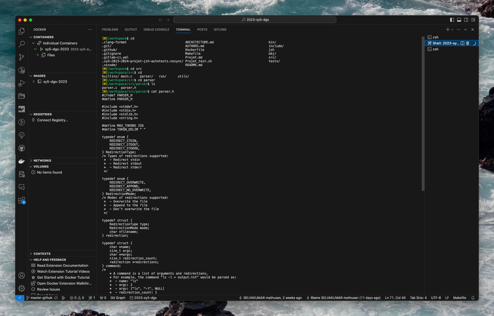
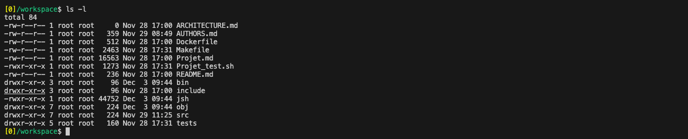
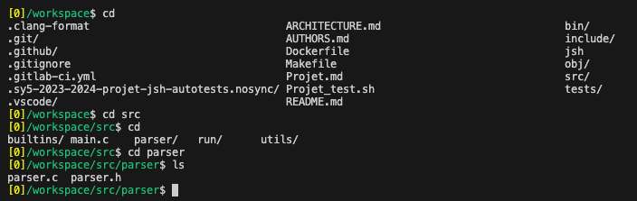

# Jsh Shell for Job Control
[](https://github.com/mathusanMe/Job-Control-Shell-Emulator/actions/workflows/main.yml)

As part of our Operating Systems course, our team is ambitiously crafting an advanced shell emulator. This project, a work-in-progress as of December 2023, focuses on sophisticated job control and system call integration, specifically tailored for Linux environments.

Our team, consisting of three dedicated members, is utilizing the C programming language for development. We leverage the robustness of the [GNU Compiler Collection (GCC)](https://gcc.gnu.org/) and the efficiency of the [GNU Make](https://www.gnu.org/software/make/) build automation tool. To ensure the reliability and stability of our shell emulator, we are also employing the [Valgrind](https://valgrind.org/) tool for meticulous memory debugging. An integral part of our development process is the continuous integration (CI) pipeline, hosted and managed via GitHub Actions.

## Table of Contents
1. [Description](#description)
2. [Visual Previews](#visual-previews)
3. [Installation](#installation)
4. [Usage](#usage)
5. [Testing](#testing)

## 1. Description
Our shell emulator, developed in C, is a compact yet powerful tool, designed with an emphasis on advanced job control and seamless system call integration. Optimized for Linux systems, it supports an array of features and commands:

### Supported Commands
- Navigation (`cd`)
- Display current directory (`pwd`)
- Exit functionality (`exit`)
- Last command exit value (`?`)
- Execution of external commands

### Advanced Features
- Command history logging
- Comprehensive job control
- Input/Output redirection
- Piping capabilities
- Management of background processes
- Efficient signal handling

## 2. Visual Previews

<p align="center">
  
  <br>
  <sub>Job Control Shell</sub>
</p>

<br>

<p align="center">
  
  <br>
  <sub>Basic Prompt View</sub>
</p>

<br>

<p align="center">
  
  <br>
  <sub>Listing Files</sub>
</p>

<br>

<p align="center">
  
  <br>
  <sub>Ever Updating Prompt</sub>
</p>

<br>

<p align="center">
  
  <br>
  <sub>Executing an External Command: Date</sub>
</p>

## 3. Installation
To install our shell emulator, follow these simple steps:
1. Clone the repository.
2. In the terminal, execute:
```bash
make
```

## 4. Usage
To run this shell, simply run the following command:
```bash
make run
```

To clean the project, simply run the following command:
```bash
make clean
```

## 5. Testing
To run the test suite, simply run the following command:
```bash
make test
```
