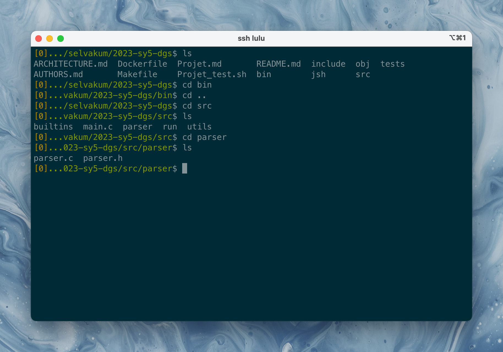
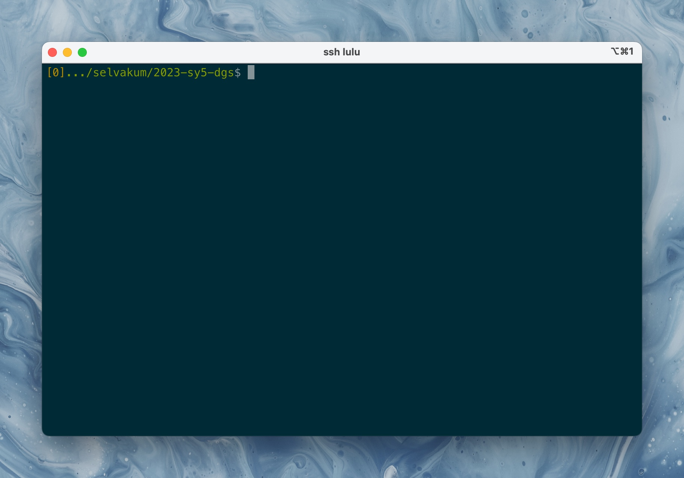
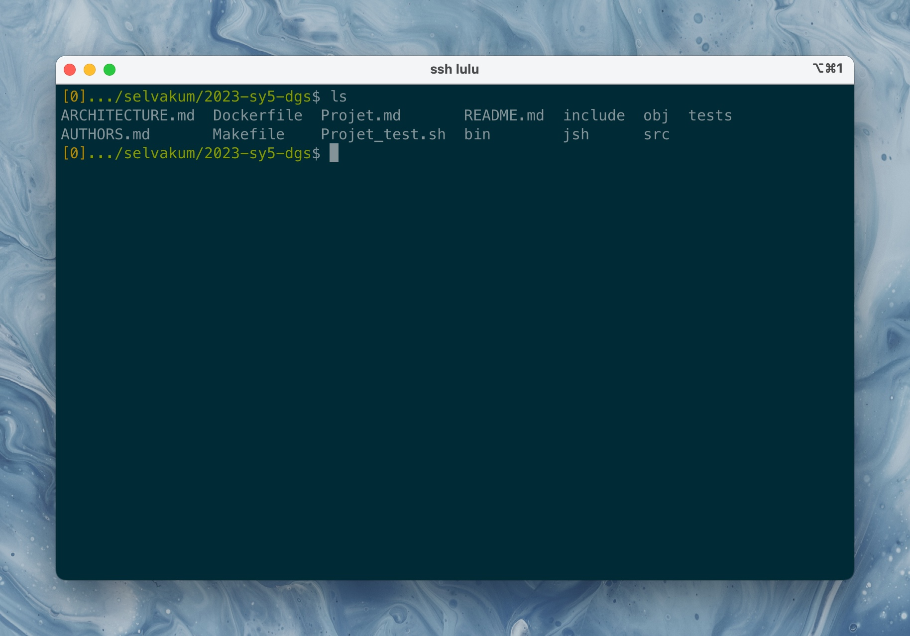
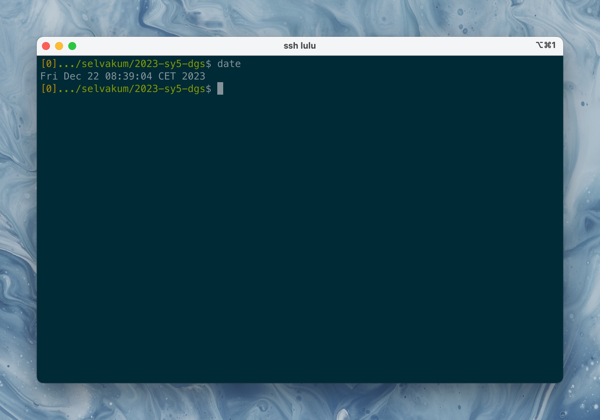
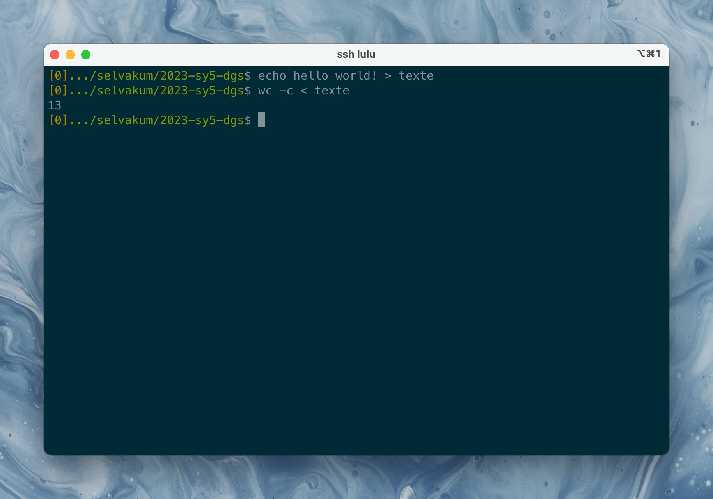
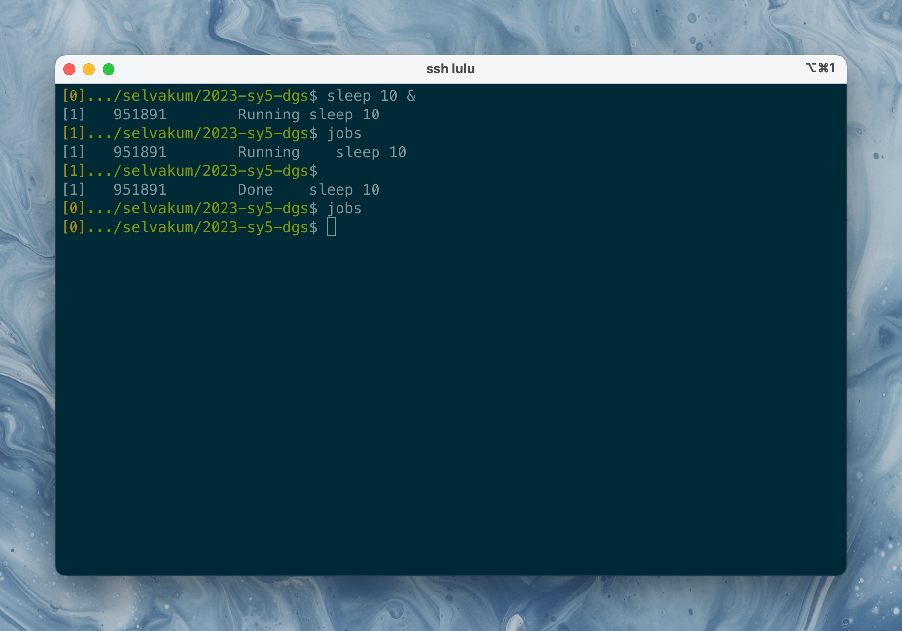
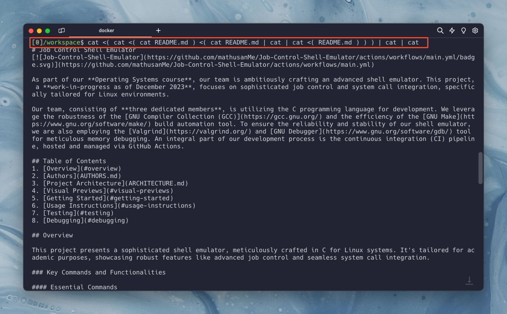

# Job Control Shell Emulator
[](https://github.com/mathusanMe/Job-Control-Shell-Emulator/actions/workflows/main.yml)

As part of our **Operating Systems course**, our team has ambitiously crafted an advanced shell emulator. This project focuses on sophisticated job control and system call integration, specifically tailored for Linux environments.

Our team, consisting of **three dedicated members**, is utilizing the C programming language for development. We leverage the robustness of the [GNU Compiler Collection (GCC)](https://gcc.gnu.org/) and the efficiency of the [GNU Make](https://www.gnu.org/software/make/) build automation tool. To ensure the reliability and stability of our shell emulator, we are also employing the [Valgrind](https://valgrind.org/) and [GNU Debugger](https://www.gnu.org/software/gdb/) tool for meticulous memory debugging. An integral part of our development process is the continuous integration (CI) pipeline, hosted and managed via GitHub Actions.

## Table of Contents
1. [Overview](#overview)
2. [Authors](AUTHORS.md)
3. [Project Architecture](ARCHITECTURE.md)
4. [Visual Previews](#visual-previews)
5. [Getting Started](#getting-started)
6. [Usage Instructions](#usage-instructions)
7. [Testing](#testing)
8. [Debugging](#debugging)

## Overview

This project presents a sophisticated shell emulator, meticulously crafted in C for Linux systems. It's tailored for academic purposes, showcasing robust features like advanced job control and seamless system call integration.

### Key Commands and Functionalities

#### Essential Commands
- **Navigation**: Change directories using `cd`.
- **Directory Display**: Show current directory with `pwd`.
- **Exiting the Shell**: Use `exit` to terminate the shell session.
- **Status of Last Command**: Query using `?`.
- **External Command Execution**: Seamlessly run external commands.
- **I/O Redirections**: Comprehensive redirection capabilities including `<`, `>`, `>>`, `>|`, `2>`, `2>>`, `2>|`.
- **Job Management**: List jobs with `jobs`, support for background execution using `&`, and job termination with `kill`.

#### Advanced Features
- **Command History**: Efficient logging of command history for easy recall.
- **Job Control**: Detailed management of foreground and background processes.
- **Input/Output Redirection**: Redirect standard input/output with ease.
- **Piping**: Facilitates the chaining of commands through piping.
- **Signal Handling**: Robust management of system signals for process control.
- **Enhanced Job Control Options**: Introducing additional controls for job management.
- **Extended Command Set**: Inclusion of commands like `fg` (foreground) and `bg` (background).
- **Advanced Piping Support**: Further development of piping functionalities.
- **Redirection Expansion**: Broader options for input/output redirections, especially in conjunction with piping.

## Visual Previews

<p align="center">
  
  <br>
  <sub>Job Control Shell</sub>
</p>

<br>

<p align="center">
  
  <br>
  <sub>Basic Prompt View</sub>
</p>

<br>

<p align="center">
  
  <br>
  <sub>Listing Files</sub>
</p>

<br>

<p align="center">
  
  <br>
  <sub>Executing an External Command: Date</sub>
</p>

<br>

<p align="center">
  
  <br>
  <sub>I/O Redirections</sub>
</p>

<br>

<p align="center">
  
  <br>
  <sub>Jobs</sub>
</p>

<br>

<p align="center">
  
  <br>
  <sub>Complex Substitution With Pipes</sub>
</p>

## Getting Started

### System Requirements
- **Operating System**: Linux-based or use Docker (Dockerfile provided).
- **Required Tools & Packages**: 
  - [GNU Compiler Collection (GCC)](https://gcc.gnu.org/) 
  - [GNU Make](https://www.gnu.org/software/make/)
  - [GNU Debugger (GDB)](https://www.gnu.org/software/gdb/)
  - [Valgrind](https://valgrind.org/)
  - [Git](https://git-scm.com/)
  - [Clang-Format](https://clang.llvm.org/docs/ClangFormat.html)
  - [libreadline-dev](https://packages.debian.org/sid/libreadline-dev)

### Installation Guide
1. **Clone the Repository**: First, clone the repository to your local machine.
2. **Compilation**: Open your terminal and navigate to the cloned repository's directory. Compile the project by executing:
   ```bash
   make all
   ```

## Usage Instructions
- **Running the Shell Emulator**: To start the shell, enter the following command in your terminal:
  ```bash
  make run
  ```
- **Cleaning the Project**: To remove all compiled files, use:
  ```bash
  make clean
  ```

## Testing
- **Running Tests**: For testing, execute:
  ```bash
  make test
  ```

This will run the provided test suite to ensure everything is functioning correctly.

## Debugging
- **GNU Debugger**: To debug the shell emulator using GDB, execute:
  ```bash
  make gdb
  ```
